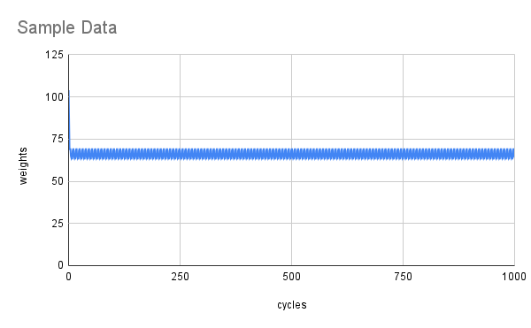
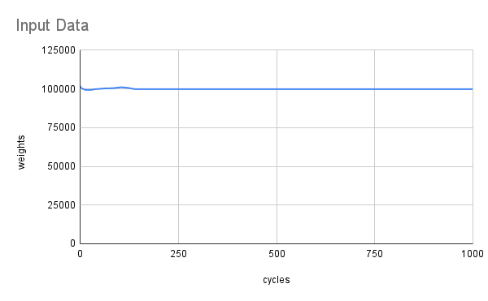
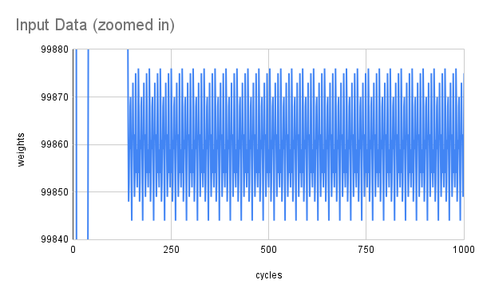

# Day 14

Brute force worked just fine for Part 1.  Only had to move the stones in one
direction.

For Part 2, I did some minor optimization as I moved the stones in all four
directions.  But when I tried to do `1,000,000` cycles on the sample data, it
still took 44 seconds.  I figured `1,000,000,000` cycles would take ~12 hours.

But, I intuited that the position of the stones would stabilize pretty quickly,
with just a few stones moving in some cycle towards towards the end.  I ran
`1,000` cycles on the sample and the real input and plotted them in Google
Sheets to confirm.

The sample data's period is 7 cycles long and starts after the third cycle.  It
then oscillates between `63` and `69`.  The billionth cycle lands on `64`.



The input data has a longer period of 28 cycles, which starts somewhere around
the 167th cycle.  It oscillates between `99844` and `99876`.  The billionth
cycle lands on a `99875`.



Here it is zoomed in:



Once we know the length of the initial period before the periodicity starts and
the length and make up of each period, we can figure out the billionth cycle by
its index in the period:

```
(1,000,000,000 - initial length) modulo (period length)
```

To find the period, I just started from the end and looked for a repeating
suffix in the list.  Then, I worked from the beginning of the list to find where
this suffix started.  I could have rotated the suffix a few times to the exact
place where the periodicity started, but I didn't really need to.  The modulo
operation took are of it just as good.
